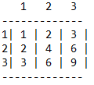

# Assignment 1: Conditions & Loops			Due Date 2/20

This assignment will will test your knowledge of Conditionals & Loops. **Be sure to read and follow all instructions.**  You'll find the table of contents for this assignment below. 

1. [Problem 1: Yearly Income](#problem-1-yearly-income)
2. [Problem 2: Calculator](#problem-2-calculator)
3. [Problem 3: Multiplication Table](#problem-3-letter-grades)
4. [Problem 4: Menus](#problem-4-menus)
5. [Problem 5: Multiplication Table](#problem-5-multiplication-table)
6. [Problem 6: Game Scores](#problem-6-game-scores)

## Problem 1: Yearly Income

Write a program that calculates a user's yearly income based on their hourly wage.

- Prompt the user for hourly wage & store into appropriately typed variable.
- Assume they work 40 hours a week, every week, all year.

Adjust the program so that it also prompts the user for # of overtime hours worked. Calculate their salary assuming the same # of overtime hours every week.

- Overtime pay earns 1.5 times the base pay.
- Output both salarys (with & without overtime) to the user.

## Problem 2: Calculator

Write a simple calculator that performs Addition, Subtraction, Multiplication, and Division between two user-supplied numbers. The operation performed should also be dictated by the user. Here is an example run (user entries are bold):

Do you want to:

1. Add

2. Subtract

3. Multiply

4. Divide

   **1**

Enter your first number: **15**

Enter your second number: **10**

15 + 10 = 25

## Problem 3: Letter Grades

Write a program that accepts a score from the user and prints the appropriate grade. Use the standard grade distribution of:

| A      | 93-100    | B+     | 87-89     | C+     | 77-79     | D     | 60-69    |
| ------ | --------- | ------ | --------- | ------ | --------- | ----- | -------- |
| **A-** | **90-92** | **B**  | **83-86** | **C**  | **73-76** | **F** | **0-59** |
|        |           | **B-** | **80-82** | **C-** | **70-72** |       |          |

Example program runs:

Enter user grade: **87**

Student earned a 'B+'

## Problem 4: Menus

Combine the above 3 programs into one. Create menus & submenus that allow you to jump between the programs all without having to re-run the program.

Example run:

- Enter calculator program
  - Calculate sum of 1 and 6
  - Calculate product of 6 and 3
  - Backup to program selection
- Enter grade program
  - Get letter grade for 88
  - Backup to program selection
- Exit program

## Problem 5: Multiplication Table

Write a program to generate a multiplication table given a user-supplied value `n`. The table should be neatly formatted using the following rules:

- Add a row of '-' above the first row, below the last row, and between all rows.
- Top left "cell" is blank
- Place a '|' between all values in the table
- Top row & left row should display the index values (numbers being multiplied for a row/cell)

Example output for `n=3`:

## Problem 6: Game Scores

Write a program which will do the following things:

- Ask the user for a number of game results *n*.
- Prompt the user for all *n* game results (the user will enter 1 for a win or 0 for a loss)
- Keep a running total of the number of victories
- After all of the results are submitted, find the win percentage
- Report that win percentage to the user

Ensure that the user only enters either a 1 or a 0! If any other value is entered, re-prompt without counting it.

